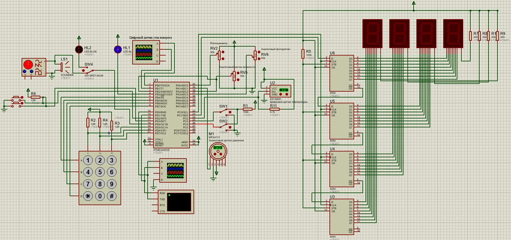

### Программирование Atmega8535 на ассемблере

1) Мигание светодиодом
2) Запись в память EEPROM
3) Динамическое считывание, работа с 7-сегментным индикатором
4) Работа с прерываниями
5) Работа с UART/USART
6) Работа с АЦП
7) Захват аналогового сигнала и сохранение в память МК
8) Реализация SPI
9) Контрольная работа

#### Схема:
